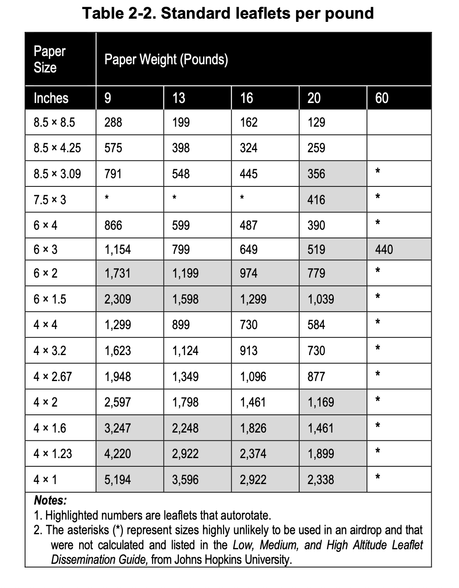
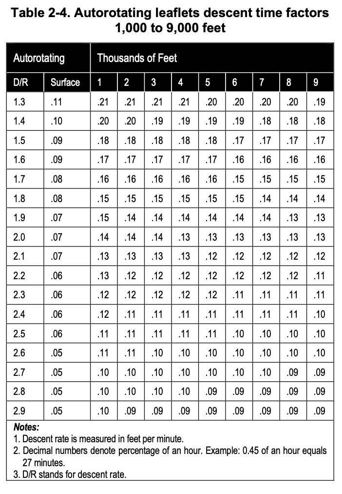

# Graphical Training Aid (GTA): Leaflet Dissemination using sUAS

This document is for academic purposes only. It provides the guidelines and manual calculations for planning and executing leaflet dissemination using Small Unmanned Aerial Systems (sUAS). The GTA incorporates open source techniques adapted specifically for sUAS operations, contrasting standard aerial dissemination practices (referenced in GTA 33-01-003).

This document further deviates from GTA 33-01-003 by using meters and kilometers instead of feet and nautical miles. A conversion to nautical miles and feet is provided in the appendix.

⸻

## Terms and Definitions

**sUAS**: Small Unmanned Aerial System

**Leaflet**: A single sheet of paper or other material used to disseminate information.

**Leaflet Dispersion**: The area that the leaflet will cover when it is dropped from a sUAS.

**Wind Azimuth**: The direction from which the wind is blowing.

**Aircraft Descent Time**: The time it takes for the aircraft to descend to the target altitude.

**Speed**:
	1.	Aircraft Speed: The speed at which the aircraft is flying.
	2.	Wind Speed: The speed at which the wind is blowing.

**Drift**:
	1.	Forward Drift: The distance the leaflet will drift forward due to the wind.
	2.	Lateral Drift: The distance the leaflet will drift laterally due to the wind.

⸻

## Section 1: Operational Considerations

_sUAS operations require accurate wind estimation and leaflet drift calculations for effective dissemination._

For comparison and historical reference, traditional aircraft methods (C‑130, F‑16, UH‑60) and high‑altitude leaflet dissemination techniques are detailed in GTA 33‑01‑003 (June 2014).

Always validate calculations with operational test drops when possible to confirm actual drift and dispersion.

⸻

## Section 2: Calculating Leaflet Dispersion from sUAS

This section details the manual methods and formulas used to estimate the dispersion area covered by leaflets when dropped from an sUAS. See Appendix A for the UAS Leaflet Drop Calculation Worksheet.

⸻

## Section 3: Historical and PSYOP Applications of Aerial Leaflet Dissemination. This section is from the GTA. 

### 3.1 Overview

Aerial leaflet dissemination is an age‑old psychological operations (PSYOP) technique that has been modernized with the advent of small unmanned aerial systems. Since 2014, conflicts such as the war in Ukraine have provided new case studies in which sUAS are used not only for reconnaissance or kinetic actions but also to deliver messages that impact morale and behavior on both the battlefield and urban settings.

### 3.2 Case Study: Ukraine (2014–Present)

#### Early Operations in Donbas (2014–2017):

During the early phases of the Donbas conflict, Ukrainian volunteer groups adapted consumer quadcopters for leaflet drops. A notable incident on May 9, 2016, involved drones releasing over 3,000 leaflets over Donetsk during a pro‑separatist parade. The leaflets carried messages such as “Donetsk is Ukraine!” and, despite enemy attempts using small arms and electronic warfare (EW), at least some drones reached their target areas. This operation demonstrated that even in contested urban airspace, inexpensive sUAS could deliver PSYOP materials effectively.

Full‑Scale Conflict and Expanded PSYOP Tactics (2022–Present):
With Russia’s full‑scale invasion in 2022, both sides enhanced drone‑based PSYOP operations:
- Surrender Appeals: Ukrainian forces have used drones not only to drop mass pamphlets but also to deliver individual surrender notes. In a widely publicized incident near Bakhmut in May 2023, a drone dropped a handwritten note instructing a stranded Russian soldier to surrender. The coordinated effort, with ground forces waiting to safely receive the soldier, illustrated how a precise, drone‑mediated leaflet drop can lead to a tactical and humanitarian advantage.
- Urban PSYOP Beyond the Frontline: In addition to battlefield applications, Ukraine extended drone leaflet drops into urban areas and even across its borders into Russian regions (e.g., Belgorod). These operations have involved distributing leaflets that urge civilians to display Ukrainian symbols or warn of impending strikes, aiming to induce confusion and undermine enemy morale.
- Russian Adaptations: Reports indicate that Russian forces have also experimented with using drones to drop propaganda materials over Ukrainian positions and even to instruct units to surrender, demonstrating that both sides have recognized the psychological value of this low‑cost, highly visible tactic.

### 3.3 Urban and Asymmetric Warfare Examples

Beyond Ukraine, urban centers and asymmetric operations have also seen the use of drone‑borne leaflet dissemination:
- Gaza Strip Operations (2018–2024):
During escalated conflicts, Israeli forces began dropping multi‑page pamphlets and “newspaper” style leaflets over Gaza urban areas. The messages aimed at sowing distrust among local governance and inducing confusion. The combination of physical leaflets, SMS messages, and drone‑borne loudspeakers has showcased a modern layered approach to PSYOP.
- Training and Exercises (Taiwan 2022):
In military exercises addressing potential urban conflicts, Taiwanese forces have integrated drone‑based leaflet drops. During a simulated invasion in Taoyuan, a PSYOP team deployed an sUAS to rapidly disseminate messages designed to demoralize an invading force or boost local morale, illustrating that these techniques are now being incorporated into formal training scenarios.

### 3.4 Technical and Operational Considerations from PSYOP Missions

The evolution of drone leaflet drops for PSYOP operations has led to several technical and operational adaptations:
- Payload and Delivery Mechanisms:
Depending on the mission—whether a mass drop or a single‑message delivery—a variety of payload delivery systems are used. Some operations rely on simple drop boxes that release a pre‑loaded bundle of leaflets, while others use mechanisms adapted from grenade‑release systems to deliver a single note accurately.
- Altitude, Speed, and Drift:
The choice of drop altitude is critical. For troop‑level targeting, altitudes in the 50–200 meter range are commonly employed to ensure the message lands within the target area. Synchronization of sUAS speed with wind drift calculations (as detailed in Section 2 and Appendix A) is crucial for mission accuracy.
- Survivability and Counter‑measures:
Drones engaged in PSYOP missions face significant risks including small arms fire, anti‑aircraft systems, and EW attempts. Tactics such as low‑altitude approach, high‑speed entry and exit, and frequency‑hopping have been adapted to reduce risk. The low cost of consumer‑grade sUAS means that even in the event of attrition, the operation remains cost‑effective.
- Coordination with Ground Forces:
Successful operations are frequently synchronized with ground‑based maneuvers. For instance, when delivering a surrender note, ground forces are alerted and ready to intercept the target, maximizing the tactical benefit of the PSYOP message.

### 3.5 Summary of PSYOP and Information Campaign Impacts

These modern PSYOP operations using sUAS have proven to be a low‑cost, high‑impact tool when used to:
- Induce enemy surrenders.
- Disrupt enemy events and create psychological disarray.
- Extend influence into urban centers and even enemy territory.

The combined lessons from Ukraine, Gaza, and controlled exercises like those in Taiwan underscore that while drone‑based leaflet dissemination may not cover as large an area as traditional methods, its precision and psychological effect can yield substantial strategic advantages.

⸻

## Section 4: Integration with Planning and Calculations

The technical principles outlined in Sections 1 and 2 are equally applicable whether the leaflet drop is conducted as a traditional PSYOP mission or in coordination with a modern urban information campaign. Operators should consider the following:
- Mission Timing and Wind Analysis:
Ensure that the calculated drift and dispersion (via the worksheet in Appendix A) take into account any adjustments required for urban terrain and rapid maneuvers characteristic of PSYOP missions.
- Payload Configuration:
Modify your payload release mechanism depending on whether you are dispersing thousands of leaflets over a mass gathering (e.g., during a parade) or delivering a single targeted message to induce surrender.
- Coordination with PSYOP Messaging:
Integrate the physical leaflet drop with other communication channels such as SMS, loudspeaker broadcasts, or social media amplification to reinforce the psychological effect on the target audience.

⸻

## Appendix A: UAS Leaflet Drop Calculation Worksheet (Meters – w/ Auto‑Rotation Factor)

This worksheet provides a manual calculation method for sUAS leaflet drops using meters. The FM‑based auto‑rotation factor of 1.11 enhances accuracy in lateral drift estimation.

### Step‑by‑Step Calculation

Step 1: Plot Wind Azimuth
- Mark the center point (target) on your map.
- Draw a line in the wind’s direction using a map protractor or compass rose (no back azimuth required).

Step 2: Descent Time

Formula:

Descent Time (s) = Altitude (m) ÷ 0.76

Example:
100 m ÷ 0.76 ≈ 131.6 seconds

Step 3: Forward and Lateral Drift
- UAS Speed (Forward Drift): 8.75 m/s (~17 knots)
- Wind Speed Conversion: Wind (kts) × 0.514 = m/s

Forward Drift = UAS Speed × Descent Time
Lateral Drift (with auto‑rotation factor) = Wind Speed (m/s) × Descent Time × 1.11

Step 4: Total Drift Estimate (Major Axis)

Total Drift = Forward Drift + (Lateral Drift ÷ 2)

Step 5: Spread Width (Minor Axis)

Minor Axis = Total Drift × Spread Factor

Step 6: Ellipse Area

Area = Major Axis × Minor Axis × 0.785

Step 7: Leaflet Density

Leaflet Density = (Leaflets ÷ Area) × 100

### Quick Reference Calculation Table

Step	Parameter	Formula/Constants	Example Calculation
1	Wind Azimuth	Map/Compass	Direction line drawn on map
2	Descent Time (s)	Altitude (m) ÷ 0.76	100 m ÷ 0.76 = 131.6 s
3	UAS Speed (Forward Drift)	8.75 m/s	8.75 × 131.6 s = 1151.5 m
3	Wind Speed Conversion (m/s)	Wind (kts) × 0.514	10 kts × 0.514 = 5.14 m/s
3	Lateral Drift (Auto‑Rotation)	Wind (m/s) × Time (s) × 1.11	5.14 m/s × 131.6 s × 1.11 = 751.3 m
4	Total Drift (Major Axis)	Forward Drift + (Lateral Drift ÷ 2)	1151.5 m + (751.3 m ÷ 2) = 1527.2 m
5	Minor Axis	Total Drift × Spread Factor	1527.2 m × 0.4 = 610.9 m
6	Ellipse Area	Major Axis × Minor Axis × 0.785	1527.2 m × 610.9 m × 0.785 ≈ 732,791 m²
7	Leaflet Density	(Leaflets ÷ Area) × 100	(10,000 ÷ 732,791 m²) × 100 ≈ 1.36 per 100 m²

⸻

## Appendix B: sUAS Leaflet Drop Tables

Include pre‑calculated tables here for different altitudes, wind speeds, and payload configurations.

⸻

## Appendix C: sUAS Leaflet Planning Examples

Provide sample mission profiles and planning scenarios based on historical case studies and current operations.

⸻

## Appendix D: References

Standards and Manuals:
- GTA 33‑01‑003: Aerial Delivery Operations (Headquarters, Department of the Army, June 2014)
- UAS Leaflet Drop Characteristics, referenced in FM 3‑05‑301 and associated sUAS operational testing documents.

Case Studies and PSYOP Applications:
- Ukrainian volunteer accounts and Euromaidan Press reports, detailing the May 2016 leaflet drop over Donetsk.
- Defense One analysis on Ukrainian drone‑mediated surrender tactics (May 2023).
- Reports from the Irregular Warfare Initiative on Ukrainian PSYOP teams using drones to induce surrenders.
- UAWire report on drone leaflet drops in Russia’s Belgorod region (June 2024).
- Sputnik News coverage of Russian Dnepr battlegroup experiments with drone‑delivered surrender pamphlets (Nov 2023).
- The New Arab reporting on Israeli drone‑borne “newspaper” drops over Gaza (Feb 2024).
- Taipei Times on Taiwan’s Han Kuang exercise incorporating drone leaflet drops (July 2022).
- Additional OSINT and defense analyses on modern drone‑enabled PSYOP operations.

